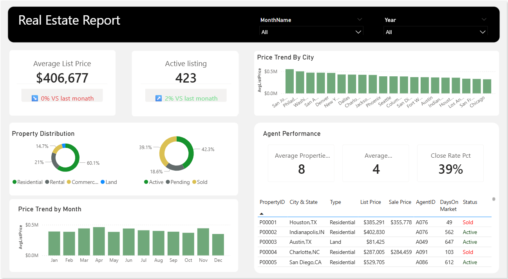

# 🏠 Real Estate Analytics Dashboard (Power BI)

## 📌 Project Overview
This project is an interactive **Real Estate Analytics Dashboard** developed using **Microsoft Power BI**.  
It provides insights into **property pricing, market trends, listing status, and agent performance**, enabling data-driven analysis of the real estate market.

---

## 📸 Dashboard Screenshot

---

## 🎯 Project Objectives
- Analyze average property prices and active listings
- Identify pricing trends across months and cities
- Understand property type and listing status distribution
- Evaluate real estate agent performance
- Enable interactive analysis using filters and slicers

---

## 📊 Key KPIs & Metrics
- **Average List Price**
- **Active Listings Count**
- **Agent Close Rate (%)**
- **Average Properties per Agent**
- **Average Closed Deals per Agent**
- **Month-over-Month Price Change (%)**
- **Month-over-Month Listing Change (%)**

---

## 📈 Dashboard Features
- KPI cards with month-over-month comparison
- Price Trend by City visualization
- Monthly Average Price Trend chart
- Property Type Distribution donut chart
- Listing Status Distribution donut chart
- Agent Performance summary cards
- Interactive slicers for Month and Year
- Detailed property table with listing status and days on market
  
---

## 🔄 Data Preparation & Modeling
- Data cleaning and transformation using **Power Query**
- Created a dedicated **Date table** for time-based analysis
- Built calculated measures using **DAX**
- Established relationships between data tables

---

## 🔍 Key Insights
- Property prices vary significantly across cities
- Monthly trends show fluctuations in average listing prices
- Residential properties dominate the market
- A large portion of listings remain active compared to sold properties
- Agent close rate is below 40%, indicating longer sales cycles

---

## 🛠 Tools & Technologies
- **Microsoft Power BI**
- **Power Query**
- **DAX (Data Analysis Expressions)**

---

## 📂 Project Files
- `Real Estate.pbix` – Power BI dashboard file  
- `README.md` – Project documentation  
- `screenshots/dashboard.png` – Dashboard screenshot  

---

## 🚀 How to Use
1. Download the `Real Estate.pbix` file
2. Open it using **Microsoft Power BI Desktop**
3. Use Month and Year slicers to explore trends
4. Interact with visuals for deeper insights

---

<!--⭐ If you find this project useful, feel free to star the repository!-->
